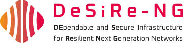
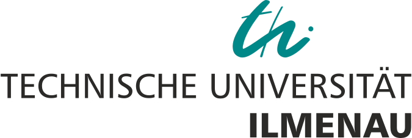
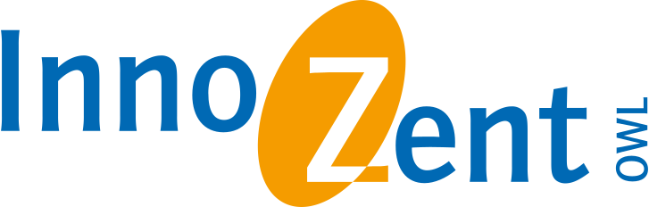
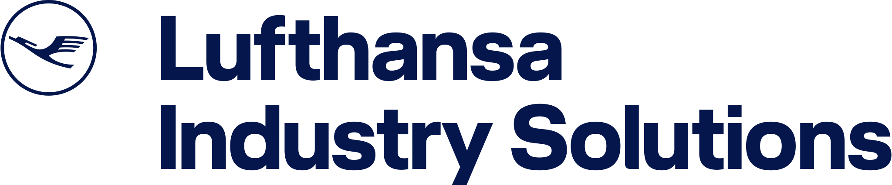
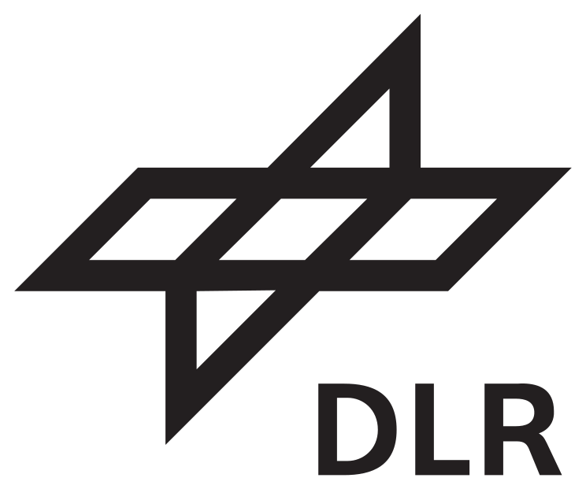
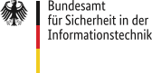

# DeSiRe-NG Consortium

## Repository Structure

## Paper

## Consortium Partners

### [Nuromedia](https://www.nuromedia.com/) (Consortium Leader)

### [Technische Universität Ilmenau](https://www.tu-ilmenau.de/)

### [Institute Industrial IT (inIT)](https://www.init-owl.de/), [OWL University of Applied Sciences and Arts (TH OWL)](https://www.th-owl.de/)

### [InnoZent OWL e.V.](https://www.innozent-owl.de/)

### [Lufthansa Industry Solutions](https://www.lufthansa-industry-solutions.com/de-de/)

### Project Sponsors

#### [Deutsches Zentrum für Luft- und Raumfahrt (DLR) Projektträger](https://projekttraeger.dlr.de/de)

#### [Bundesamt für Sicherheit in der Informationstechnik (BSI)](https://www.bsi.bund.de/DE/Home/home_node.html)

## Contributing

### NUROMEDIA

### OWL University of Applied Sciences and Arts

### Technische Universität Ilmenau

<!--

**Here are some ideas to get you started:**

🙋‍♀️ A short introduction - what is your organization all about?
🌈 Contribution guidelines - how can the community get involved?
👩‍💻 Useful resources - where can the community find your docs? Is there anything else the community should know?
🍿 Fun facts - what does your team eat for breakfast?
🧙 Remember, you can do mighty things with the power of [Markdown](https://docs.github.com/github/writing-on-github/getting-started-with-writing-and-formatting-on-github/basic-writing-and-formatting-syntax)
-->
